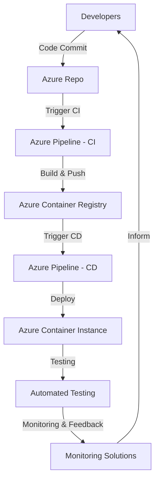

# 🚀 Automated Azure Container Instance Deployment using Azure DevOps CI/CD Pipelines


## 📌 Project Overview

This project demonstrates the automation of containerized application deployment using **Azure DevOps CI/CD pipelines** and **Azure Container Instances (ACI)**. It is designed to enable rapid, reliable, and isolated testing of applications in non-production environments.

> 🧠 **Note**: This project is manually designed, written, and implemented — **not auto-generated by GitHub**. All scripts and documentation are tailored for clarity and real-world implementation.

## 💼 Business Problem

A leading finance company needs an efficient and reliable way to manage the development and testing of **containerized applications** outside the production environment.

### ❗ Challenges:
- Manual, error-prone deployment process
- Lack of isolated test environments
- Delays in verifying application functionality

### ✅ Solution:
Leverage **Azure Container Instances** and **Azure DevOps CI/CD pipelines** to:
- Automate application delivery
- Provide isolated, repeatable testing environments
- Ensure minimal disruption to production systems

## 🛠️ Prerequisites

- Azure subscription
- Azure DevOps organization and project
- Dockerized Spring Boot Java application
- Azure Container Registry (ACR)
- Service Principal with contributor role
- Azure DevOps Service Connection

## High-Level Architecture


## 🔁 CI/CD Workflow

1. Code Commit → Azure Repos
2. CI Pipeline → Build Docker Image → Push to ACR
3. CD Pipeline → Pull from ACR → Deploy to ACI
4. Post-deployment Testing
5. Monitoring and Feedback

## ⚙️ Setup Instructions

### Clone the Repository
```bash
git clone https://github.com/your-username/your-repo-name.git
cd your-repo-name
```

### Build Docker Image
```bash
docker build -t springboot-app .
```

### Push to ACR
```bash
az login
az acr login --name <yourACRName>
docker tag springboot-app <yourACRName>.azurecr.io/springboot-app
docker push <yourACRName>.azurecr.io/springboot-app
```

## 🧩 Azure DevOps Pipeline Configuration

### CI Pipeline (`azure-pipelines.yml`)
```yaml
trigger:
  - main

pool:
  vmImage: ubuntu-latest

variables:
  imageName: 'springboot-app'

steps:
- task: Docker@2
  inputs:
    command: 'buildAndPush'
    repository: $(imageName)
    dockerfile: '**/Dockerfile'
    containerRegistry: '<Your-Service-Connection>'
    tags: 'latest'
```

### CD Pipeline (`deploy-aci.yml`)
```yaml
trigger:
  - main

pool:
  vmImage: ubuntu-latest

steps:
- task: AzureCLI@2
  inputs:
    azureSubscription: '<Your-Service-Connection>'
    scriptType: 'bash'
    scriptLocation: 'inlineScript'
    inlineScript: |
      az container create         --resource-group <your-rg>         --name springboot-aci         --image <yourACRName>.azurecr.io/springboot-app:latest         --cpu 1         --memory 1         --registry-login-server <yourACRName>.azurecr.io         --registry-username ${{ secrets.ACR_USERNAME }}         --registry-password ${{ secrets.ACR_PASSWORD }}         --dns-name-label springboot-demo-app         --ports 8080
```

## 📚 References

- [ACI Deployment using Azure DevOps](https://learn.microsoft.com/en-us/azure/container-instances/container-instances-tutorial-azure-devops)
- [Docker Build with Azure Pipelines](https://learn.microsoft.com/en-us/azure/devops/pipelines/languages/docker)
- [Azure Container Registry Guide](https://learn.microsoft.com/en-us/azure/container-registry/)
- [Create Service Connections](https://learn.microsoft.com/en-us/azure/devops/pipelines/library/service-endpoints)

## ✅ Summary

This project enables:
- 🚀 CI/CD automation for containerized apps
- 🧪 Safe and isolated non-prod testing
- 📊 Monitoring, observability, and easy iteration

> ⚠️ This repository is manually created as a learning project for DevOps automation.  
> Not generated or scaffolded by GitHub or external tools.

## 🙋‍♂️ Author

**Kamlesh Rankawat**  
DevOps Enthusiast | B.Tech Final Year  
🔗 [LinkedIn](https://www.linkedin.com/in/kamlesh-rankawat-73b698361)  
📧 rankawatkamlesh02022006@gmail.com
